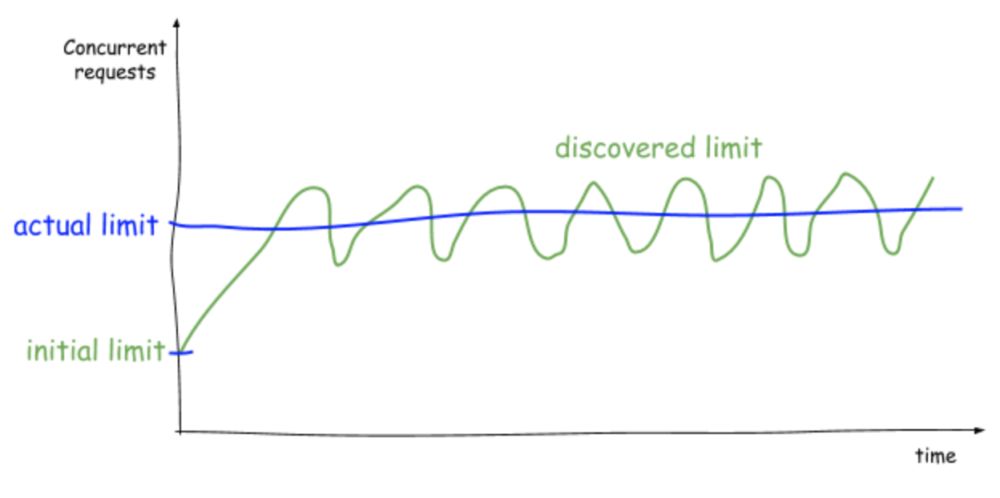
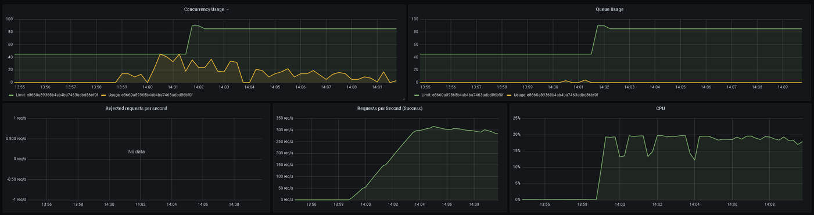

# Summary
[summary]: #summary

The goal of this RFC is to have a solution to make services more resilient. By enabling the capability to auto-adjust the accepted traffic based on the runtime performance, therefore decreasing the possibility of downtime and outages.

# Motivation
[motivation]: #motivation

Currently, there are several ways to control the concurrency of a service: Kong plugins, load balancer configurations, and concurrency limit frameworks.

But in those options, the limits are configurated through settings with static values, and every time rises the same question: How many requests can my service handle simultaneously?

This occurs because it is very difficult to determine the service capacity since it can change in runtime and it depends on several factors:

* The resource limits (Memory, CPU, Threads)
* The limit of each service dependency (Http Service, Database, Cache)
* The Network latency

The concurrency limit of a system can be measured using Little’s law, which describes the service concurrency limit as the product of the throughput x average latency, and the excess of requests should be enqueued or rejected.

It is possible to measure the service metrics in runtime. It enables the possibility of calculating and dynamically changing the limits on the fly to protect the services from outages.

# Guide Implementation
[guide-level-explanation]: #guide-level-explanation

The idea is to adapt the concurrency limit according to the service performance in runtime based on the average time spent executing the request.

## Time Tracking

First of all, it is important to collect the data that will be used to determine the performance degradation, each request, the round trip time should be tracked and accumulated, the number of requests should be increased and the MinRTT (Minimum Round Trip Time) could be updated if the duration of the request is less the current MinRTT.

```csharp
totalTime += durationInMs;
numberOfExecutions++;
avgRTT = totalTime / numberOfExecutions;

if (durationInMs < minRTT)
    minRTT = durationInMs;
```

## Finding the Concurrency Limit

It is possible to determine the limit using the TCP congestion control algorithm and to change the limit with the increase of the RTT (Round trip time).

`NewConcurrencyLimit = (MinRTT * Tolerance / AvgRTT) * CurrentLimit + QueueSize`

The limit should start at a small initial point and it will increase while the formula returns a positive value until finding a stable point.

When there is a load in the system the average RTT will increase and the concurrency limit decreases to adapt and control the response times.



## How to find the max queue size?

### Square Root queue size

In this mode the queue size will be always the square root of the concurrency limit, It is the logic used by the Netflix concurrency limit because the square root is a small value that increases when the concurrency limit increases.

This is a more rigid strategy and tends to reject more requests to control better the response times.

### RPS Capacity

This strategy uses the average RTT to calculate the number of samples accepted by second for each concurrency item accepted.

`queueSize = (1000 / avgRTT) * ConcurrencyLimit`

When the average time or the concurrency limit changes the queue size increases or decreases to maintain the average RTT controlled.

## When the max capacity is reached

If the concurrency limit is reached and all queue slot is in use the requests will be rejected using for that the status code [503 (ServiceUnavailable)](https://developer.mozilla.org/en-US/docs/Web/HTTP/Status/503).

## Partitions

There are some scenarios when the limits can change according to the context like HTTP methods, endpoint priority, or relevance.

To cover this scenario should be provided a way to configure the partition name per context, If it is not configurated it should use the global partition.

## Request Prioritization

The RFC related to the request prioritization feature is available [here](/rfcs/0003-APPROVED-request-prioritization.md).

## Metrics

To monitor the service performance and to support the auto-scaling in the case of overload a set of metrics should be provided by the concurrency limiter.

### http_requests_queue_time_seconds

This metric is a histogram that represents the time each request spent in the queue until its executed.

| Label | Description |
| ----- | ----------- |
| method | The HTTP method of the request |
| priority | Priority of the rejected request (critical, normal, noncritical) |

### http_requests_concurrency_limit_total

This metric is a gauge that represents the current concurrency limit.

### http_requests_concurrency_items_total

This metric is a gauge that represents the current number of execution in concurrency.

### http_requests_queue_limit_total

This metric is a gauge that represents the current queue size.

### http_requests_queue_items_total

This metric is a gauge that represents the items waiting to be processed in the queue. 

| Label | Description |
| ----- | ----------- |
| method | The HTTP method of the request |
| priority | Priority of the rejected request (critical, normal, noncritical) |

### http_requests_rejected_total

This metric is a counter that represents the number of requests rejected because the queue limit is reached.

| Label | Description |
| ----- | ----------- |
| method | The HTTP method of the request |
| priority | Priority of the rejected request (critical, normal, noncritical) |

Below there is an example of a visualization of the metrics, it is possible to view when the limits are reached and the rejected items.



## Auto Scaling

Using KEDA it is possible to use Prometheus metrics to trigger the creation of PODs and auto-scaling the application when there is an overload in the service.

The http_requests_queue_items_total can help to auto-scaling the service, once the service has items in the queue it can trigger the scale-up of the application.

# Reference Implementation
[reference-level-explanation]: #reference-level-explanation

The proposal is to create a specific package for dealing with concurrency limiting that encapsulates all the logic to calculate the limit and also gives support for other types of settings like memory limit, CPU usage limit, and max allowed response times.

## Core Implementation

The idea is to create a core framework that implements a concurrency limiting in any desired code block, it will provide a builder to help create the limiter through parameters.

The limiter instance will provide a method Execute where the function to execute will be placed.

```csharp
var limiter = new ConcurrencyLimiterBuilder()
    .WithOptions(options =>
    {
        options.MinConcurrencyLimit = minLimit;
        options.MaxConcurrencyLimit = maxLimit;
        options.MinQueueSize = minQueueLimit;
    })
    .WithSquareRootQueueSizeStrategy()
    .Build();
    
await limiter.ExecuteAsync(() => next());
```

So, with the core implementation, it will be possible to control the concurrency limit of any method or function.

## AspNet Core Extension

A new separated package will be created to implement the concurrency limit in middlewares and controller actions.

### Middleware Extension

An extension will be created to include the concurrency limiter in the request execution pipeline.

```csharp
    app.UseConcurrencyLimiter((provider, builder) =>
    {
        builder
            .WithOptions(options =>
            {
                options.MinConcurrencyLimit = 20;
                options.InitialConcurrencyLimit = 50;
                options.InitialQueueSize = 50;
            })
            .WithPartition(context => context.Request.Path)
            .WithSquareRootQueueSizeStrategy()
            .WithLogger(provider.GetRequiredService<ILogger<AdaptativeConcurrencyLimiter>>())
            .WithMetricsListener(listener =>
            {
                listener.OnChanged = metrics =>
                {
                    metricsHandler.MetricsChanged(metrics);
                };

                listener.OnReject = () =>
                {
                    metricsHandler.Reject();
                };
            });
    });
```

### Controller Action Attributes

Also, an attribute will be provided for the case of limit a specific endpoint.

```csharp
  [HttpGet]
  [ConcurrencyLimiter(minLimit: 20, maxLimit: 2000, minQueueLimit: 20)]
  public async Task<List<Product>> Get()
  {
      return await collection.Find(FilterDefinition<Product>.Empty).ToListAsync();
  }
```

## Open Source Extension

Another solution is to contribute to the community and to create an open-source extension to [Microsoft Rate Limiting implementation](https://github.com/dotnet/aspnetcore/tree/main/src/Middleware/RateLimiting).

```csharp
var options = new RateLimiterOptions();
options.DefaultRejectionStatusCode = 503;
options.Limiter = new PartitionedAdaptativeConcurrencyLimiter<HttpContext>(limitOptions =>
{
    limitOptions.MinConcurrencyLimit = minLimit;
    limitOptions.MaxConcurrencyLimit = maxLimit;
    limitOptions.MinQueueSize = minQueueLimit;
});

app.UseRateLimiter(options);
```

# Drawbacks
[drawbacks]: #drawbacks

It is a solution that needs to be maintained internally by a team even if it is open source.

On the other hand, turning it open-source will enable the contribution of the dotnet community.

# Rationale / Alternatives
[rationale-and-alternatives]: #rationale-and-alternatives

The rationale for creating a dotnet library is to assist, and have and easy and simple way of having these techniques in services.

Another alternative is to create load balancing or gateway plugins with this logic, it could be used in a layer above and it could be reused by any technology.

# Learn More/References:

* [Netflix - Performance Under Load](https://netflixtechblog.medium.com/performance-under-load-3e6fa9a60581)
* [Netflix Concurrency Limiter GitHub Repository](https://github.com/Netflix/concurrency-limits)
* [Vector Request Limiter](https://github.com/vectordotdev/vector/blob/master/rfcs/2020-04-06-1858-automatically-adjust-request-limits.md)
* [AIMD - TCP Congestion Control](https://en.wikipedia.org/wiki/Additive_increase/multiplicative_decrease)
* [RFC - Request Prioritization](/rfcs/0003-APPROVED-request-prioritization.md)
* [Load Shedding To Avoid Overload](https://aws.amazon.com/builders-library/using-load-shedding-to-avoid-overload/)