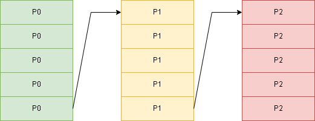
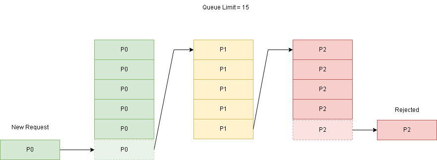

# Summary
[summary]: #summary

Since there is already a mechanism to automatically detect the service limits based on internal behavior and excessive requests are discarded, it becomes necessary to stipulate different priorities per request, with the objective of prioritizing more important requests or critical flows.

# Motivation
[motivation]: #motivation

Every service has a finite capacity to handle requests, these limitations are related to several factors such as: performance of dependencies, available resources (CPU and Memory).

Once the service reaches its maximum capacity, it is important to have a way of defining which are the priority tasks (requests), so that it is possible to direct the available resources to what is most important.

Thus, we can guarantee that in overload scenarios the most critical parts of the service will be less affected by requests of lower importance.

# Guide Implementation
[guide-level-explanation]: #guide-level-explanation

Once the concurrency limit is reached, the requests are added to a queue in an ordered way, regardless of their priority, until the maximum capacity of the queue is reached.

The purpose of this RFC is to change this structure so that it is possible to categorize incoming requests by priority and to order their execution.

## Queue Structure

The idea is to create a structure with multiple chained queues so that the last item of a queue references the first item of the next lower priority queue, below there is an image that demonstrates this structure.



## Queue Flow

When a request arrives, the algorithm checks if the priority of the new request is greater than the item with the lowest priority, if so, the new request is added to the queue related to its priority and the last item is discarded, below there is an example of the execution flow.



**Note**: The flow above is only applied when the service is overloaded.

## Prioritization Definition

There are several strategies for defining request priorities, these strategies can be adopted case-by-case depending on the business rules related to each service.

The accepted priority values are:

- **non-critical**: The request doesn't affect directly the end user. i.e: Background jobs, Kafka consumer handlers.
- **normal**: The request may affect normal business operations, but it is possible to manage it by retrigging later or having a degraded experience for the end user.
- **critical**: The request is critical and if not fulfilled it will have a high impact on the business. i.e: prevent a sale, show an error to the user.

### Endpoint Priority

In this case, each endpoint has its internal priority defined by code.

```csharp
[HttpGet]
[Route("WeatherForecast")]
[EndpointPriority(EndpointPriorities.Critical)]
public async Task<IEnumerable<WeatherForecast>> GetAll()
{
    ...
}
```

When the priority is defined in the endpoint level it overcomes the other strategies.

### HTTP Header Priority

An HTTP header (X-Priority) is sent defining the priority of the request.

```bash
curl http://localhost:9999/WeatherForecast -H "X-Priority: critical"
```

In the LoadShedding library configuration the `WithHeaderPrioritizationStrategy` strategy should be configured.

```csharp
app.UseLoadShedding((provider, configurator) =>
{
    configurator.UseAdaptativeLimiter((builder) =>
    {
        builder
            .WithHeaderPrioritizationStrategy("X-Priority")
            .WithOptions(options =>
            {
                ...
            });
    });
});
```

### User Claim Priority (Out of MVP)

A specific user (token) may have a higher priority than others, in this case the priority is loaded from the user claims and the priority is applied.

i.e: tenant_id, plan tier, client_id, etc.

In the LoadShedding library configuration the `WithUserClaimPrioritizationStrategy` strategy should be configured.

```csharp
app.UseLoadShedding((provider, configurator) =>
{
    configurator.UseAdaptativeLimiter((builder) =>
    {
        builder
            .WithUserClaimPrioritizationStrategy("tenant_id")
            .WithOptions(options =>
            {
                ...
            });
    });
});
```

### Custom Priority

A factory is provided to allow the developers to define a function with a custom logic to resolve the request priority.

```csharp
app.UseLoadShedding((provider, configurator) =>
{
    configurator.UseAdaptativeLimiter((builder) =>
    {
        builder
            .WithPriorityResolver(context =>
            {   
                // Any custom logic
                if (context.Request.Headers.TryGetValue("X-Priority", out var values))
                {
                    return Convert.ToInt32(values.First());
                }

                return 0;
            })
            .WithOptions(options =>
            {
                ...
            });
    });
});
```

## Metrics

There is already a metric to collect the number of enqueued items and the idea is to add a new label priority. 

### http_requests_queue_total

**Type**: Gauge

**Description:** The total number of requests currently present in the request queue.

| Label     | Description |
| --------- | ----------- |
| method | (GET, PUT, POST, DELETE, HEAD, OPTIONS) |
| uri | The route used to serve the request, UNKNOWN if the route is not known |
| **priority** | (noncritical, normal, critical) |

### http_requests_rejected_total

**Type**: Counter

**Description:** The total number of requests rejected, requests not processed, and not on the request queue.

| Label     | Description |
| --------- | ----------- |
| method | (GET, PUT, POST, DELETE, HEAD, OPTIONS) |
| uri | The route used to serve the request, UNKNOWN if the route is not known |
| reason | MaxConcurrentRequests, MaxCpuUsage, MaxMemoryUsage |
| **priority** | (noncritical, normal, critical) |

### http_requests_queue_time_seconds

**Type**: Histogram

**Description:** Provides the time waiting in the queue.

| Label     | Description |
| --------- | ----------- |
| method | (GET, PUT, POST, DELETE, HEAD, OPTIONS) |
| uri | The route used to serve the request, UNKNOWN if the route is not known |
| **priority** | (noncritical, normal, critical) |

### Health Checks and Metrics Exportation

This solution adds an middleware in the request execution pipeline and the health check and metrics middlewares should be placed before the LoadShedding middleware to avoid reject those requests.

# Drawbacks
[drawbacks]: #drawbacks

This solution tends to increase the time of the requests with low priorities when there is an overload since they will be moved down in the queue when a request with higher priority arrives.