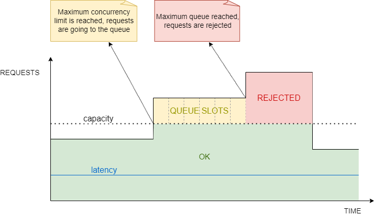

# Adaptative Concurrency Limiter

In this section, we will learn how **adaptative concurrency limiter** works on LoadShedding.

The adaptative concurrency limiter provides a capacity to auto-adjust the accepted traffic based on the runtime performance, ensuring that latencies remain low.

As can be seen in the previous image (adapted from [Performance Under Load Article](https://netflixtechblog.medium.com/performance-under-load-3e6fa9a60581)):

* the requests are processed since the number of capacity + the number of queue slots is not reached.
* as soon as the maximum concurrency limit is reached (possible to configure), the requests will enter a queue.
* the requests that are waiting in the queue, will be released by a FIFO (First In, First Out) methodology, although, it is possible to configure prioritization accross requests, meaning, requests with high priority will be handled first.
* as soon as the maximum queue size is reached, the system will automatically reject the following requests, returning a `503 - Service Unavailable` error.
* the latency will be kept low independent of the number of requests.
* the capacity/concurrency limit will be automatically calculated through some algorithms taking into account the service performance degradation.

## How it works

The following animation shows requests being processed with LoadShedding:

