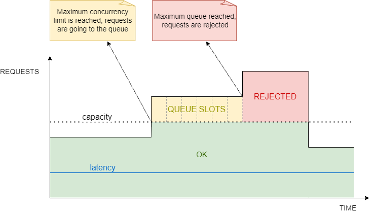

# Register Concurrency Adaptative Limiter

The concurrency adaptative limiter provides a capacity to auto-adjust the accepted traffic based on the runtime performance, ensuring that latencies remain low.



As can be seen in the previous image (adapted from [Performance Under Load Article](https://netflixtechblog.medium.com/performance-under-load-3e6fa9a60581)):

* the requests are processed since the number of capacity + the number of queue slots is not reached.
* as soon as the maximum concurrency limit is reached (possible to configure), the requests will enter a queue.
* the requests that are waiting in the queue, will be released by a FIFO (First In, First Out) methodology.
* as soon as the maximum queue size is reached, the system will automatically reject the following requests, returning a 503 - Service Unavailable error.
* the latency will be kept low independent of the number of requests.
* the capacity/concurrency limit will be automatically calculated through some algorithms taking into account the service performance degradation.

## How to use it

### Base Configuration

Install all the needed services by calling `IServiceCollection.AddLoadShedding`.

```csharp
app.AddLoadShedding();
```

Extend the `IApplicationBuilder` using the `UseLoadShedding` extension method.

```csharp
app.UseLoadShedding();
```

### Options Configuration

It is possible to have access to additional configurations when registering the services.

```csharp
services.AddLoadShedding((provider, options) =>
{
    options.AdaptativeLimiter.ConcurrencyOptions.MinQueueSize = 10;
    options.AdaptativeLimiter.UseHeaderPriorityResolver();
    options.SubscribeEvents(events =>
    {
        events.ItemEnqueued.Subscribe(args => Console.WriteLine($"QueueLimit: {args.QueueLimit}, QueueCount: {args.QueueCount}"));
        events.ItemDequeued.Subscribe(args => Console.WriteLine($"QueueLimit: {args.QueueLimit}, QueueCount: {args.QueueCount}"));
        events.ItemProcessing.Subscribe(args => Console.WriteLine($"ConcurrencyLimit: {args.ConcurrencyLimit}, ConcurrencyItems: {args.ConcurrencyCount}"));
        events.ItemProcessed.Subscribe(args => Console.WriteLine($"ConcurrencyLimit: {args.ConcurrencyLimit}, ConcurrencyItems: {args.ConcurrencyCount}"));
        events.Rejected.Subscribe(args => Console.Error.WriteLine($"Item rejected with Priority: {args.Priority}"));
    });
});
```

By default, the following `ConcurrencyOptions` values will be used:

| Option | Description | Default Value |
| ------ | -------- | -------- |
| MinConcurrencyLimit | The minimum number of concurrent requests allowed | 5 |
| InitialConcurrencyLimit | The starting number of concurrent requests allowed. This may be adjusted up or down based on the performance of the system | 5 |
| MaxConcurrencyLimit | The maximum number of concurrent requests allowed | 500 |
| Tolerance | The level of flexibility in adjusting the concurrency limit. It indicates how much change in the minimum latency is acceptable before lowering the concurrency limit threshold. A high tolerance means the system can adjust the concurrency limit more freely, while a low tolerance means the limit will be maintained more strictly. For example, a value of 2.0 means a 2x increase in latency is acceptable | 1.5 |
| MinQueueSize | The minimum number of requests that must be waiting in the queue before new requests can be processed | 20 |
| InitialQueueSize | The starting number of requests in the queue | 20 |
| QueueTimeoutInMs | The queue waiting timeout, when the timeout is reached the task will be canceled and will throw an OperationCanceledException. | Infinite |

**Note:** These default values were defined based on:

* investigation of the [Netflix Concurrency Limit](https://github.com/Netflix/concurrency-limits) tool.
* having a huge margin of tolerance: accepting 500 requests simultaneously (and 50 more going to the queue - initially).

On the other hand, if needed, these settings can be completely overridden by using the `ConcurrencyOptions` property:

```csharp

services.AddLoadShedding((provider, options) =>
{
    options.AdaptativeLimiter.ConcurrencyOptions.MinConcurrencyLimit = 5;
    options.AdaptativeLimiter.ConcurrencyOptions.InitialConcurrencyLimit = 5;
    options.AdaptativeLimiter.ConcurrencyOptions.InitialQueueSize = 50;
    options.AdaptativeLimiter.ConcurrencyOptions.Tolerance = 2;
    options.AdaptativeLimiter.ConcurrencyOptions.QueueTimeoutInMs = 60000;
});
```

When defining the options values, the following criteria need to be accomplished:

* MinConcurrencyLimit, InitialConcurrencyLimit, MaxConcurrencyLimit, MinQueueSize, and MinQueueSize >= 1
* Tolerance > 1
* MaxConcurrencyLimit > MinConcurrencyLimit
* InitialConcurrencyLimit >= MinConcurrencyLimit && MaxConcurrencyLimit >= InitialConcurrencyLimit
* InitialQueueSize >= MinQueueSize

### Events Listener Configuration

It is possible to monitor the service performance by subscribing internal events:

* QueueLimitChanged: invoked whenever the queue limit is changed.
* QueueItemsCountChanged: invoked whenever an item is enqueued or dequeued.
* ConcurrencyLimitChanged: invoked whenever the concurrency limit is changed.
* ConcurrentItemsCountChanged: invoked whenever an item is being processed or it is finished.
* ItemEnqueued: invoked whenever a task is enqueued.
* ItemDequeued: invoked whenever a task is dequeued.
* Rejected: invoked whenever there are rejected requests - queue limit is reached.

```csharp
services.AddLoadShedding((provider, options) =>
{
    options.SubscribeEvents(events =>
    {
        events.ItemEnqueued.Subscribe(args => Console.WriteLine($"QueueLimit: {args.QueueLimit}, QueueCount: {args.QueueCount}"));
        events.ItemDequeued.Subscribe(args => Console.WriteLine($"QueueLimit: {args.QueueLimit}, QueueCount: {args.QueueCount}"));
        events.ItemProcessing.Subscribe(args => Console.WriteLine($"ConcurrencyLimit: {args.ConcurrencyLimit}, ConcurrencyItems: {args.ConcurrencyCount}"));
        events.ItemProcessed.Subscribe(args => Console.WriteLine($"ConcurrencyLimit: {args.ConcurrencyLimit}, ConcurrencyItems: {args.ConcurrencyCount}"));
        events.Rejected.Subscribe(args => Console.Error.WriteLine($"Item rejected with Priority: {args.Priority}"));
    });
});
```

### Custom Queue Size Calculator Configuration

Calculating the queue size has the main goal to find the maximum value of requests allowed to be in the queue.

The default queue size calculator is based on the square root of the concurrency limit value.

Optionally, the strategy can be overridden by:

#### 1 - Implement the IQueueSizeCalculator interface

```csharp
    public class CustomQueueSizeCalculator : IQueueSizeCalculator
    {
        public int CalculateQueueSize(IConcurrencyContext context)
        {
            // Implement the Calculate Queue Size logic here

            return default;
        }
    }
```

#### 2 - Use a custom QueueSizeCalculator

```csharp
services.AddLoadShedding((provider, options) =>
{
    options.AdaptativeLimiter.QueueSizeCalculator = new CustomQueueSizeCalculator();
});
```

### Request Prioritization Configuration

It is possible to configure the settings to establish priority resolvers for requests.

At present, only one strategy is supported, which means that solely the most recently configured strategy will be implemented.

#### Http Header Priority Resolver

With the extension `UseHeaderPriorityResolver` it will automatically convert the value of the HTTP Header `X-Priority` to the request priority.

The allowed values are: critical, normal and non-critical

```csharp
services.AddLoadShedding((provider, options) =>
{
    options.AdaptativeLimiter.UseHeaderPriorityResolver();
});
```

#### Endpoint Priority Resolver

With the extension `UseEndpointPriorityResolver` it will automatically load the Priority defined for the endpoint from the `EndpointPriorityAttribute`.

```csharp
services.AddLoadShedding((provider, options) =>
{
    options.AdaptativeLimiter.UseEndpointPriorityResolver();
});
```

Also, add `EndpointPriorityAttribute` in the action.

```csharp
[HttpGet]
[Route("people")]
[EndpointPriority(Priority.Critical)]
public async Task<IActionResult> GetPeopleAsync()
{
    return this.Ok(new[]
    {
        new Person
        {
            Id = 1,
            Age = 18,
            UserName = "john.doe"
        }
    });
}
```

### Including Metrics

The library has the option to export adaptative limiter metrics to Prometheus.

#### Install Package

```bash
dotnet add package Farfetch.LoadShedding.Prometheus
```

#### Configure

Use the `LoadSheddingOptions` extension method `AddMetrics()`.
The metrics includes the label `method` that describes the HTTP method. For this value to be correctly parsed, the `HTTPContextAccessor` should be included otherwise the `method` label will output the value `UNKNOWN`.

```csharp
builder.Services.AddHttpContextAccessor();

services.AddLoadShedding((provider, options) =>
{
    options.AddMetrics();
});
```

`AddMetrics` has additional options that supports renaming and enable/disable specific metrics.

```csharp
options.AddMetrics(options =>
{
    options.QueueLimit.Enabled = false;
    options.ConcurrencyLimit.Enabled = false;
    options.RequestRejected.Enabled = false;
});
```

#### Reference Documentation

| Metric Name | Metric Description | Metric Type |  Labels |
| ----------- | ------------------ | ----------- |  ------ |
| http_requests_concurrency_items_total | The current number of executions concurrently  | gauge |  |
| http_requests_concurrency_limit_total | The current concurrency limit | gauge |  |
| http_requests_queue_items_total | The current number of items waiting to be processed in the queue | gauge | method (HTTP method of the request), priority (critical, noncritical, normal) |
| http_requests_queue_limit_total | The current queue limit size | gauge |   |
| http_requests_queue_time_seconds | The time each request spent in the queue until its executed | histogram | method (HTTP method of the request), priority (critical, noncritical, normal) |
| http_requests_rejected_total | The number of requests rejected because the queue limit is reached | counter | method (HTTP method of the request), priority (critical, noncritical, normal), reason (max_queue_items, queue_timeout) |
